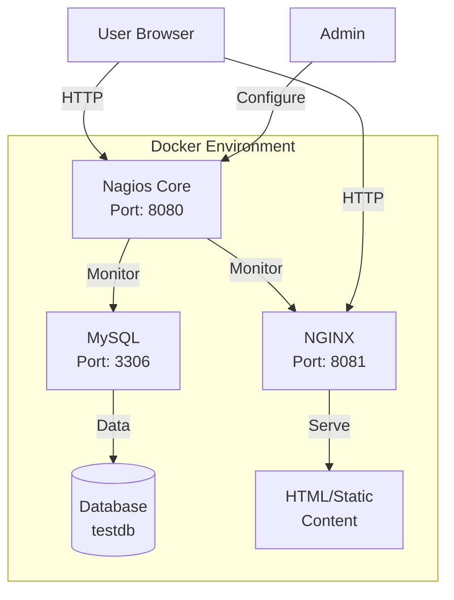
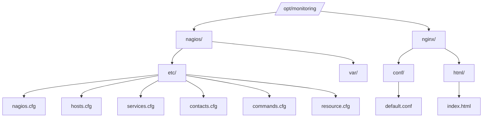
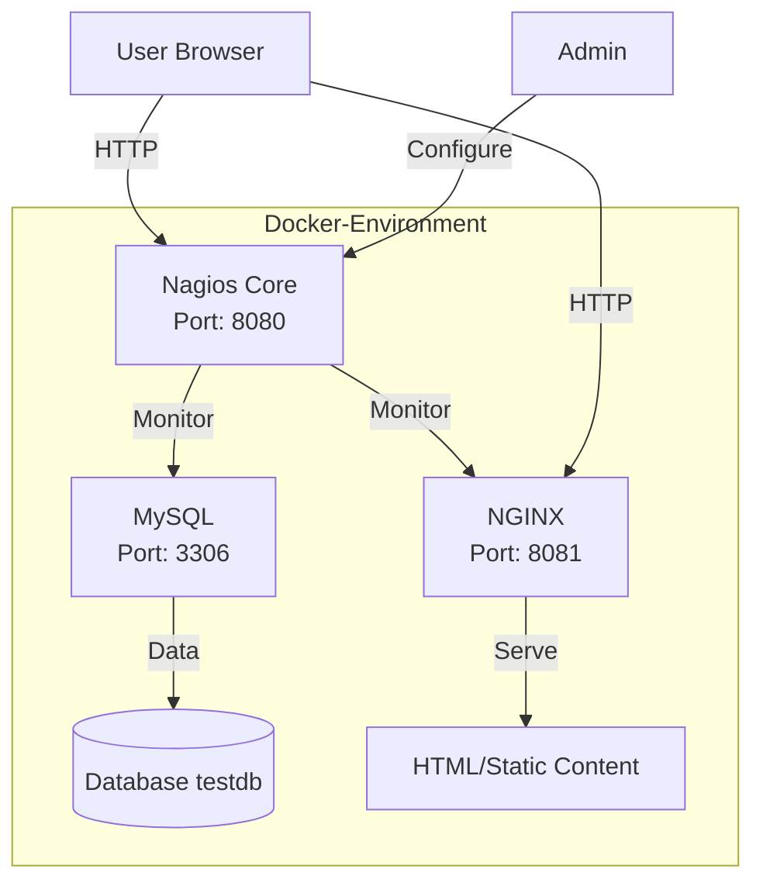
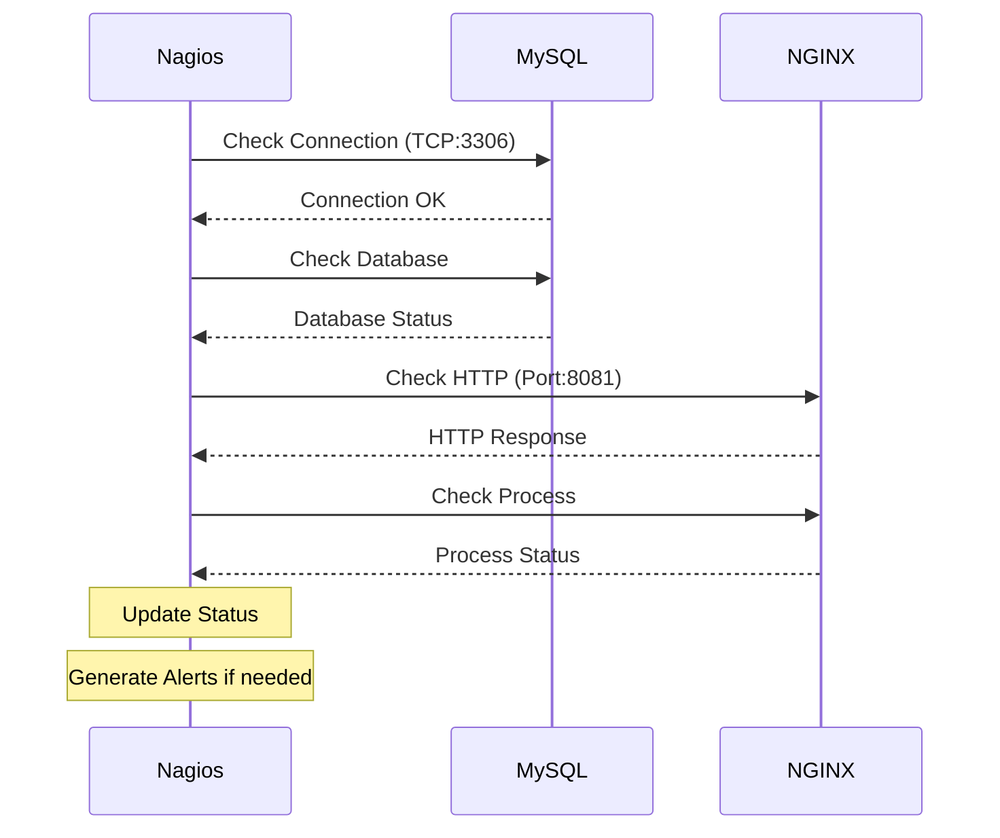

# Guía Completa: Implementación de un Sistema de Monitoreo Empresarial con Nagios, MySQL y NGINX usando Docker

## Índice
1. [Introducción y Requisitos](#1-introducción-y-requisitos)
2. [Preparación del Entorno](#2-preparación-del-entorno)
3. [Configuración de Docker](#3-configuración-de-docker)
4. [Configuración de Nagios](#4-configuración-de-nagios)
5. [Configuración de MySQL](#5-configuración-de-mysql)
6. [Configuración de NGINX](#6-configuración-de-nginx)
7. [Verificación y Pruebas](#7-verificación-y-pruebas)
8. [Solución de Problemas](#8-solución-de-problemas)
9. [Mantenimiento y Backup](#9-mantenimiento-y-backup)

## Arquitectura del Sistema

Este sistema implementa monitoreo de servicios usando Nagios Core en Docker.



## Estructura del Proyecto



## Arquitectura del Sistema


## 1. Introducción y Requisitos

### 1.1 Objetivos del Proyecto
- Implementar un sistema de monitoreo centralizado usando Nagios Core
- Monitorear servicios críticos (MySQL y NGINX)
- Implementar la solución usando contenedores Docker
- Configurar alertas y notificaciones
- Establecer una base de datos de prueba y un sitio web funcional

### 1.2 Requisitos Previos
```bash
# Actualizar el sistema
sudo apt-get update
sudo apt-get upgrade -y

# Instalar dependencias necesarias
sudo apt-get install -y \
    apt-transport-https \
    ca-certificates \
    curl \
    software-properties-common \
    git
```

## 2. Preparación del Entorno

### 2.1 Crear Estructura de Directorios
```bash
# Crear directorio principal
sudo mkdir -p /opt/monitoring
cd /opt/monitoring

# Crear subdirectorios usando la sintaxis expandida
sudo mkdir -p nagios/{etc,var}
sudo mkdir -p nginx/{conf,html}

# Asignar permisos necesarios
sudo chmod -R 777 nagios
sudo chmod -R 777 nginx

# Verificar la estructura creada
ls -la
tree # Si está instalado
```

### 2.2 Verificar Estructura
La estructura debe verse así:
```
/opt/monitoring/
├── nagios/
│   ├── etc/
│   └── var/
└── nginx/
    ├── conf/
    └── html/
```

## 3. Configuración de Docker

### 3.1 Crear docker-compose.yml
```bash
sudo nano /opt/monitoring/docker-compose.yml
```

Contenido del docker-compose.yml:
```yaml
version: '3'

services:
  nagios:
    image: jasonrivers/nagios:latest
    ports:
      - "8080:80"
    volumes:
      - /opt/monitoring/nagios/etc:/opt/nagios/etc
      - /opt/monitoring/nagios/var:/opt/nagios/var
      - nagios_plugins:/usr/lib/nagios/plugins
    environment:
      - NAGIOSADMIN_USER=nagiosadmin
      - NAGIOSADMIN_PASS=nagios123
    depends_on:
      - mysql
      - nginx

  mysql:
    image: mysql:8.0
    environment:
      - MYSQL_ROOT_PASSWORD=rootpass
      - MYSQL_DATABASE=testdb
      - MYSQL_USER=nagios
      - MYSQL_PASSWORD=nagios123
      - MYSQL_ROOT_HOST=%
    ports:
      - "3306:3306"
    command: 
      - --default-authentication-plugin=mysql_native_password
      - --bind-address=0.0.0.0
    volumes:
      - mysql_data:/var/lib/mysql

  nginx:
    image: nginx:latest
    ports:
      - "8081:80"
    volumes:
      - ./nginx/conf:/etc/nginx/conf.d
      - ./nginx/html:/usr/share/nginx/html

volumes:
  mysql_data:
  nagios_plugins:
```

### 3.2 Iniciar Contenedores
```bash
# Asegurarse de estar en el directorio correcto
cd /opt/monitoring

# Levantar los contenedores
sudo docker-compose up -d

# Verificar que los contenedores están corriendo
sudo docker-compose ps
```

## 4. Configuración de Nagios

### 4.1 Configurar resource.cfg
```bash
sudo nano /opt/monitoring/nagios/etc/resource.cfg
```

Contenido:
```
$USER1$=/usr/lib/nagios/plugins
```

### 4.2 Configurar hosts.cfg
```bash
sudo nano /opt/monitoring/nagios/etc/hosts.cfg
```

Contenido:
```cfg
# MySQL Server
define host {
    use                     linux-server
    host_name               mysql_server
    alias                   MySQL Database Server
    address                 mysql
    check_command           check-host-alive
    max_check_attempts      5
    check_period           24x7
    notification_interval   30
    notification_period     24x7
}

# NGINX Server
define host {
    use                     linux-server
    host_name               nginx_server
    alias                   NGINX Web Server
    address                 nginx
    check_command           check-host-alive
    max_check_attempts      5
    check_period           24x7
    notification_interval   30
    notification_period     24x7
}

# Define hostgroups
define hostgroup {
    hostgroup_name          web-servers
    alias                   Web Servers
    members                 nginx_server
}

define hostgroup {
    hostgroup_name          db-servers
    alias                   Database Servers
    members                 mysql_server
}
```

### 4.3 Configurar services.cfg
```bash
sudo nano /opt/monitoring/nagios/etc/services.cfg
```

Contenido:
```cfg
# MySQL Services
define service {
    use                    generic-service
    host_name              mysql_server
    service_description    MySQL Connection Status
    check_command         check_tcp!3306
    check_interval        5
    retry_interval        1
    max_check_attempts    5
}

define service {
    use                    generic-service
    host_name              mysql_server
    service_description    MySQL Database
    check_command         check_mysql!nagios!nagios123!testdb
    check_interval        5
    retry_interval        1
    max_check_attempts    5
}

# NGINX Services
define service {
    use                    generic-service
    host_name              nginx_server
    service_description    NGINX HTTP
    check_command         check_http!-p 8081
    check_interval        5
    retry_interval        1
    max_check_attempts    5
}

define service {
    use                    generic-service
    host_name              nginx_server
    service_description    NGINX Process
    check_command         check_procs!1:!nginx
    check_interval        5
    retry_interval        1
    max_check_attempts    5
}
```

### 4.4 Configurar contacts.cfg
```bash
sudo nano /opt/monitoring/nagios/etc/contacts.cfg
```

Contenido:
```cfg
define contact {
    name                            generic-contact
    service_notification_period     24x7
    host_notification_period        24x7
    service_notification_options    w,u,c,r
    host_notification_options       d,u,r
    service_notification_commands   notify-service-by-email
    host_notification_commands      notify-host-by-email
    register                       0
}

define contact {
    use                            generic-contact
    contact_name                   nagiosadmin
    alias                         Nagios Admin
    email                         admin@localhost
}

define contactgroup {
    contactgroup_name              admins
    alias                         Nagios Administrators
    members                       nagiosadmin
}
```

### 4.5 Instalar Plugins y Cliente MySQL en Nagios
```bash
# Entrar al contenedor de Nagios
sudo docker-compose exec nagios bash

# Actualizar e instalar plugins
apt-get update
apt-get install -y nagios-plugins

# Instalar cliente MySQL
apt-get install -y default-mysql-client

# Verificar instalación de plugins
ls -la /usr/lib/nagios/plugins/

# Crear directorios necesarios
mkdir -p /opt/nagios/var/spool/checkresults
chmod -R 775 /opt/nagios/var/spool/checkresults

# Salir del contenedor
exit
```
###  Flujo de Monitoreo



## 5. Configuración de MySQL

### 5.1 Configurar Acceso a MySQL
```bash
# Entrar al contenedor MySQL
sudo docker-compose exec mysql bash

# Conectar a MySQL
mysql -u root -prootpass

# Ejecutar comandos SQL
CREATE USER 'nagios'@'%' IDENTIFIED BY 'nagios123';
GRANT ALL PRIVILEGES ON *.* TO 'nagios'@'%';
FLUSH PRIVILEGES;

# Verificar permisos
SHOW GRANTS FOR 'nagios'@'%';

# Salir de MySQL y del contenedor
exit
exit
```

### 5.2 Crear Base de Datos de Prueba
```bash
# Crear archivo SQL
sudo nano /opt/monitoring/init.sql
```

Contenido de init.sql:
```sql
USE testdb;

-- Crear tabla de empleados
CREATE TABLE empleados (
    id INT AUTO_INCREMENT PRIMARY KEY,
    nombre VARCHAR(50),
    cargo VARCHAR(50),
    departamento VARCHAR(50),
    fecha_ingreso DATE
);

-- Insertar datos de prueba
INSERT INTO empleados (nombre, cargo, departamento, fecha_ingreso) VALUES
    ('Juan Pérez', 'Desarrollador', 'TI', '2023-01-15'),
    ('María García', 'Analista', 'Finanzas', '2023-02-20'),
    ('Carlos López', 'Gerente', 'Recursos Humanos', '2023-03-10'),
    ('Ana Martínez', 'DBA', 'TI', '2023-04-05');

-- Crear tabla de departamentos
CREATE TABLE departamentos (
    id INT AUTO_INCREMENT PRIMARY KEY,
    nombre VARCHAR(50),
    presupuesto DECIMAL(10,2)
);

-- Insertar datos de departamentos
INSERT INTO departamentos (nombre, presupuesto) VALUES
    ('TI', 100000.00),
    ('Finanzas', 80000.00),
    ('Recursos Humanos', 60000.00);
```

### 5.3 Importar Base de Datos
```bash
# Copiar el archivo SQL al contenedor
sudo docker cp /opt/monitoring/init.sql monitoring_mysql_1:/init.sql

# Entrar al contenedor MySQL
sudo docker-compose exec mysql bash

# Importar script SQL
mysql -u root -prootpass < /init.sql

# Verificar la importación
mysql -u root -prootpass -e "USE testdb; SHOW TABLES;"
```

## 6. Configuración de NGINX

### 6.1 Crear Página Web
```bash
sudo nano /opt/monitoring/nginx/html/index.html
```

Contenido del index.html:
```html
<!DOCTYPE html>
<html>
<head>
    <title>Servidor Web de Prueba</title>
    <style>
        body {
            font-family: Arial, sans-serif;
            line-height: 1.6;
            margin: 40px;
        }
        .container {
            max-width: 800px;
            margin: 0 auto;
            padding: 20px;
            border: 1px solid #ddd;
            border-radius: 5px;
        }
        h1 {
            color: #333;
            text-align: center;
        }
    </style>
</head>
<body>
    <div class="container">
        <h1>Bienvenido al Servidor Web</h1>
        <p>Esta es una página de prueba para el servidor NGINX monitoreado por Nagios.</p>
        <div>
            <h2>Información del Servidor:</h2>
            <ul>
                <li>Servidor: NGINX</li>
                <li>Puerto: 8081</li>
                <li>Monitoreo: Nagios Core</li>
            </ul>
        </div>
    </div>
</body>
</html>
```

### 6.2 Configurar NGINX
```bash
sudo nano /opt/monitoring/nginx/conf/default.conf
```

Contenido de default.conf:
```nginx
server {
    listen       80;
    server_name  localhost;

    location / {
        root   /usr/share/nginx/html;
        index  index.html index.htm;
    }

    location /nginx_status {
        stub_status on;
        access_log off;
        allow 127.0.0.1;
        allow 172.16.0.0/12;
        deny all;
    }
}
```

## 7. Verificación y Pruebas

### 7.1 Verificar Configuración de Nagios
```bash
# Verificar configuración
sudo docker-compose exec nagios /opt/nagios/bin/nagios -v /opt/nagios/etc/nagios.cfg
```

### 7.2 Verificar Servicios
```bash
# Verificar MySQL
sudo docker-compose exec nagios mysql -h mysql -u nagios -pnagios123 testdb -e "SELECT * FROM empleados;"

# Verificar NGINX
curl http://localhost:8081
```

### 7.3 Acceder a Interfaces Web
1. Nagios:
   - URL: http://IP-DEL-SERVIDOR:8080/nagios
   - Usuario: nagiosadmin
   - Contraseña: nagios123

2. NGINX:
   - URL: http://IP-DEL-SERVIDOR:8081

## 8. Solución de Problemas

### 8.1 Problemas de Permisos
```bash
# Dentro del contenedor Nagios
sudo docker-compose exec nagios bash
chown -R nagios:nagios /opt/nagios/var
chmod -R 775 /opt/nagios/var
```

### 8.2 Problemas de Conexión MySQL
```bash
# Verificar estado de MySQL
sudo docker-compose ps mysql

# Verificar logs
sudo docker-compose logs mysql

# Probar conexión
sudo docker-compose exec nagios mysql -h mysql -u nagios -pnagios123 testdb
```

### 8.3 Problemas con NGINX
```bash
# Verificar configuración
sudo docker-compose exec nginx nginx -t

# Ver logs
sudo docker-compose logs nginx
```

## 9. Mantenimiento y Backup

### 9.1 Backup de Configuraciones
```bash
# Crear backup
cd /opt/monitoring
sudo tar -czf nagios-backup-$(date +%Y%m%d).tar.gz nagios/etc nginx/conf

# Backup de la base de datos
sudo docker-compose exec mysql mysqldump -u root -prootpass testdb > backup-$(date +%Y%m%d).sql
```

### 9.2 Reinicio de Servicios
### apaga los servicios 
sudo docker-compose down 
sudo docker-compose up -d 

